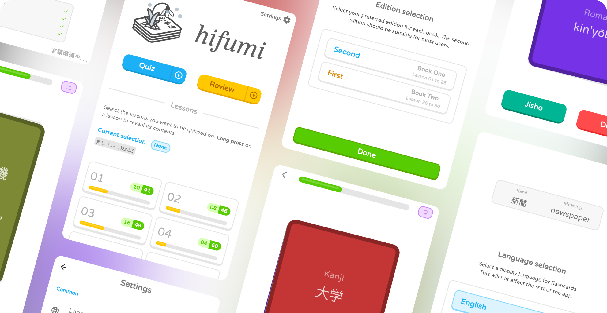

<div align="center">
  <a href="https://vitto4.github.com/hifumi">
    
  </a>
</div>

<p align="center">
  <a href="https://flutter.dev/">
    </a>
  <a href="https://github.com/vitto4/hifumi/blob/main/LICENSE">
    </a>
  <a href="https://github.com/vitto4/hifumi/releases">
    </a>
</p>

<p align="center">A flashcards companion app tailored for <code>Minna no Nihongo Shokyū Ⅰ & Ⅱ</code> textbooks.</p>

<p align="center"><sup>❄&#xFE0E;</sup></p>

<div align="center">
  <picture></picture>
</div>

## 🧭 Table of contents

1. [Overview](#-overview)
2. [Installation](#-installation)
3. [Development](#️-development)
4. [Notes](#-notes)
5. [Contributing](#-contributing)

## ☁ Overview

Got a vocab test looming in your Japanese class ? Feeling overwhelmed by the mountain of words in your `Minna no Nihongo` lessons and not sure where to start ? <br>
Worry no more, _there's an app for that_ !

This readme mostly discusses technical stuff 🧙‍♂️ <br>
Should you simply wish to give the app a whirl, your journey awaits beneath –


<p align="center">
  <a href="https://vitto4.github.io/hifumi"><kbd> ⥼<b> Web version </b>⥽ </kbd></a><picture></picture><a href="https://github.com/vitto4/hifumi/releases"><kbd> ⥼<b> Android version </b>⥽ </kbd></a>
</p>

<p align="center"><sup><ins>Note</ins> – You may also use the web version on Android.</sup></p>


<br>


**hifumi** was meant to be a replacement for [*Minna no Flashcards*](https://play.google.com/store/apps/details?id=com.factory201.minnanoflashcards "now pulled from the Play Store"), reworked with the whole **fifty lessons** of the [`Minna no Nihongo Shokyū`](https://www.3anet.co.jp/np/en/list.html?af=1&g=7-12-33&s=1 "みんなの日本語 初級 Ⅰ & Ⅱ") books. <br>
And well, that is what it ended up being, but an overengineered one for sure !

It also packs additional quality of life features, such as being able to create custom lists of words to study (called _decks_), opening [Jisho.org](https://jisho.org) with the click of a button, and more !


## 📦 Installation

#### Web

The [web app](https://vitto4.github.com/hifumi) requires no particular installation.

A prebuilt version is also offered in the [releases](https://github.com/vitto4/hifumi/releases). It can be used locally by running something like `python3 -m http.server` in the root of the folder.

#### Android

1. Head over to the [releases](https://github.com/vitto4/hifumi/releases) page.
2. Grab the right `apk` for you phone's CPU architecture. If unsure, get the `arm64-v8a` version, this corresponds to what most smartphones run on nowadays.
3. Install it like you would with any other `apk` file. Opening it from your device's file manager usually does the trick.

#### iOS & Others

At the moment, only precompiled binaries for _Android_ and _Web_ are offered. Therefore, the **Web** version should be used on all other platforms. If you'd like to see a platform added, you're welcome to open an issue :)

## 🛠️ Development

Interested in modifying the source or building the app yourself ?

You will need a working copy of the **Dart SDK** and **Flutter SDK**, with `Web` and `Android` development set up. If you're new to this don't worry, it is pretty straightforward to set up, check out [Install | Flutter](https://docs.flutter.dev/get-started/install).

1. Clone the repository : `git clone --recurse-submodules https://github.com/vitto4/hifumi.git && cd hifumi`
2. Get dependencies : `flutter pub get`
3. You are now ready to `flutter run` 🎉

If you end up modifying an icon, you may also need to `flutter pub run flutter_launcher_icons`.

#### 🏗️ Build & Release

For the detailed build process, take a look at the build workflows in [`.github/build-*.yml`](./.github/workflows/). <br>
**tl;dr** your usual flutter business, except a few [things](./lib/entities/app_info.dart#L18-L20) are overwritten here and there.

As for the **Pages**, it is more of a rolling release and may be deployed whenever from the main branch.

#### 📅 Wishlist

A couple of things I may get to someday

- [ ] For the `Web` release, compile to Wasm once compatibility spans all browsers (see [Wasm | Flutter](https://docs.flutter.dev/platform-integration/web/wasm#learn-more-about-browser-compatibility)).
- [ ] Make use of [macros](https://dart.dev/language/macros) to write the _version number_ and _commit hash_ to `app_info.dart` at compile time, instead of relying on external tools in the build workflows.
- [ ] Include a dark theme.
- [ ] Look into adding iOS as a build target (would need sideloading support first though).

#### 🧱 Structure

I might have got a little carried away when deciding on folder names, so here's a much-needed file structure overview !

<div align="center">
<details>
  <summary><code>Show structure</code></summary>
  <div align="left">

  ```
  .
  lib/
  ├── entities/             # Definitions, defaults, concepts and building blocks for the rest of the code.
  │
  ├── pages/                # Pages of the app.
  │
  ├── services/             # Utility services for the app, including interfacing with the dataset, data storage, layout management, and more.
  │
  ├── widgets/
  │    ├── archipelago/     # Home for island-style widgets, including containers, buttons, segmented selectors, etc.
  │    │
  │    ├── casino/          # (Flash)cards related widgets.
  │    │
  │    ├── drawer/          # Widgets related to sheet dialogs (and thus to quick-settings menus).
  │    │       
  │    ├── roofing/         # Tile widgets. (word-, lesson-)
  │    │
  │    ├── seasoning/       # Catch-all for miscellaneous widgets sprinkled throughout the app.
  │    │
  │    ├── settings/        # Settings-specific widgets.
  │    │
  │    ├── topping/         # Widgets placed at the top of various pages.
  │    │
  │    └── *.dart           # Various widgets that didn't fit in categories described above.
  │
  └── main.dart
  ```

  </div>
</details>
</div>

## 🔖 Notes

- I have come to the realisation that UI/UX design is very much not easy (ᴗ.ᴗ). Thus, I've « borrowed » the design language from a suspiciously intimidating Owl. <br>
  > Dear Duo, <br>
  > Please don't come for me, I did my lesson today, and if the borrowing isn't fine I'll happily comply ! <br>
  > Thankies :3

  (fancy reaching out ? claim your [Free OSINT Technique™](https://cheatsheet.haax.fr/open-source-intelligence-osint/platforms-hunting/github/#finding-user-e-mail))
- The *dataset* from which all words are sourced lives on GitHub as a separate project : [`MinnaNoDS`](https://github.com/vitto4/MinnaNoDS).
- Files starting with an `@` symbol are definitions of basic concepts and building blocks for the app.
  I wanted them grouped together. It may not be pretty, but it works c:
- To save on asset size, fonts have been subsetted.
  - <ins>Noto Serif Japanese</ins> to `あ`
  - <ins>New Tegomin</ins> to `あ字言葉準備中.`
  - <ins>Noto Sans Japanese</ins> to whatever [`noto_sans_JP`](./fonts/tools/fonts_subsetting.py#L66) ends up being.

  See also [`fonts_subsetting.py`](./fonts/tools/fonts_subsetting.py) and [`fonts-subsetting.yml`](./.github/workflows/fonts-subsetting.yml).
- Some widgets should be easy to reuse standalone in another app. These include [`swipeable.dart`](./lib/widgets/swipeable.dart) and [`island_container.dart`](./lib/widgets/archipelago/island_container.dart). If these sound like they could be useful for your project, be sure to take a look !

## 🧩 Contributing

You're very welcome to pitch in ! <br>
That being said, as I'm still pretty new to everything flutter and app development, the code can be a bit all over the place ; so proceed at your own risks (:

Also I probably won't devote much time to this project in the near future, so please bear with me if I'm slow on the reply ^-^